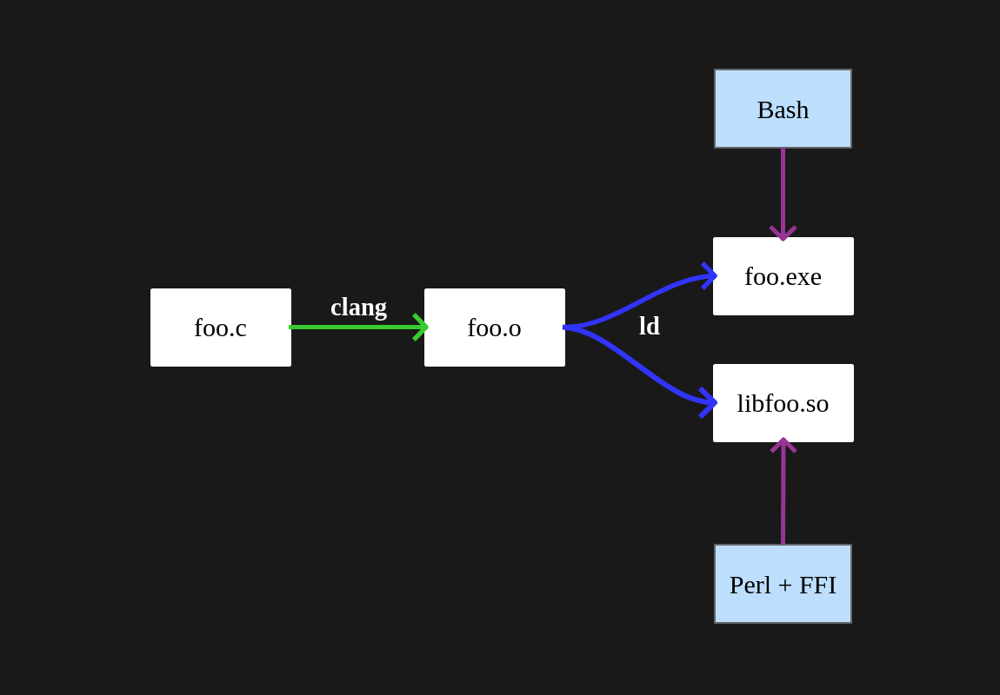
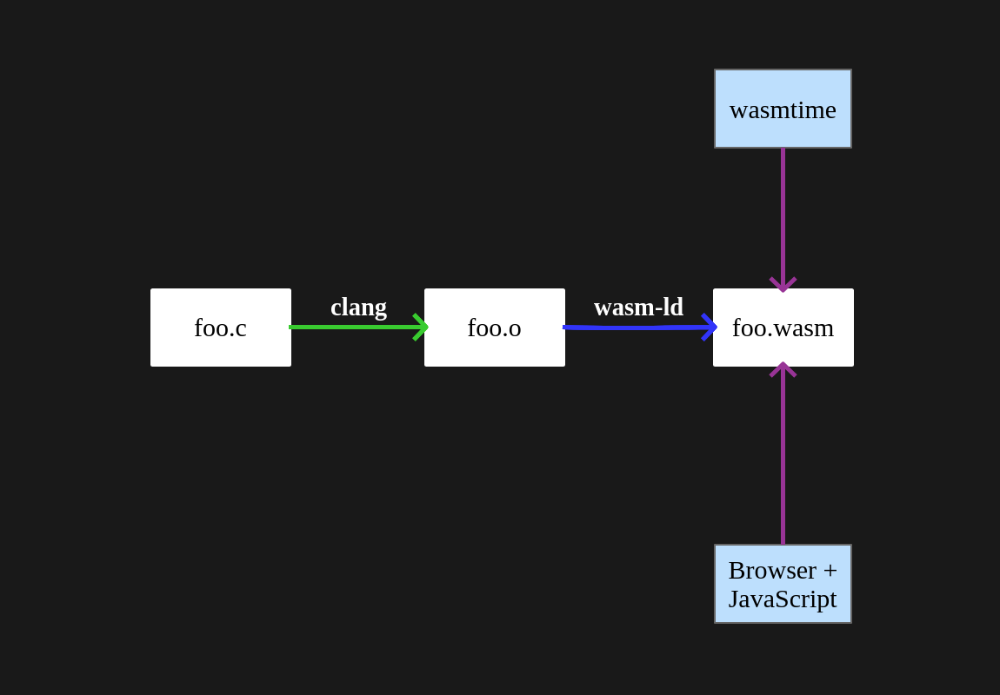
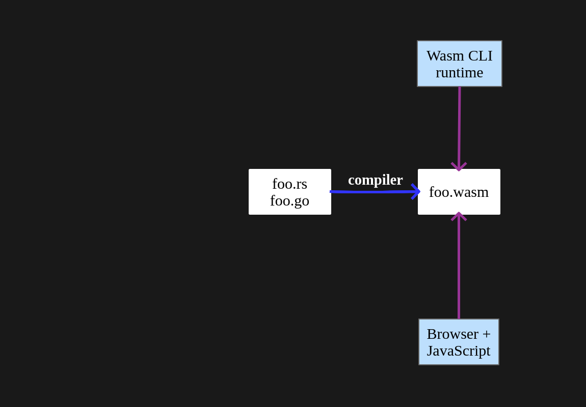
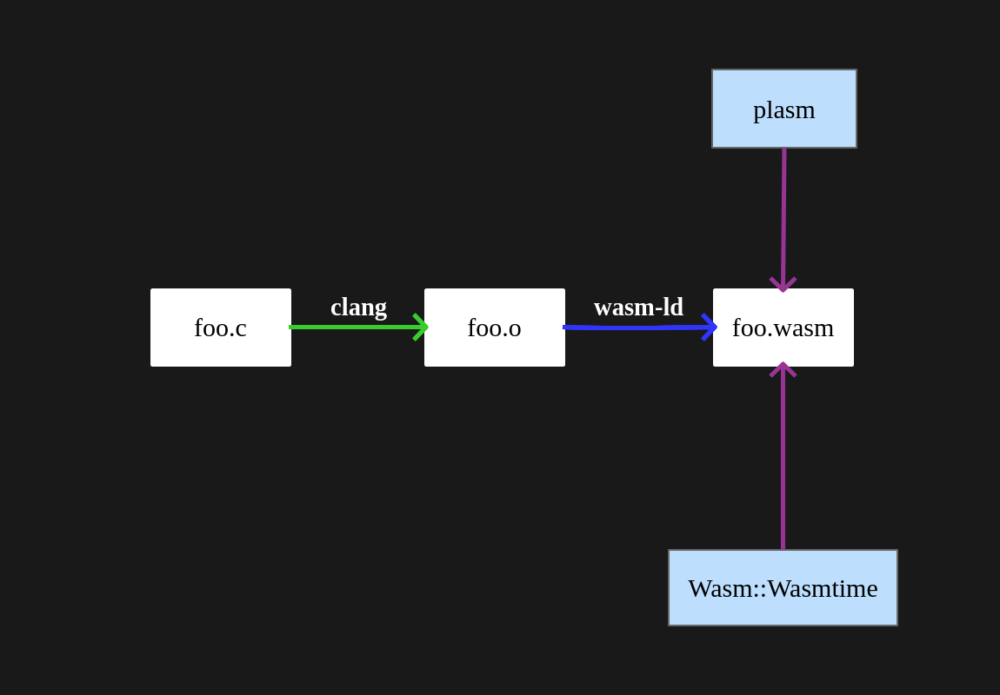
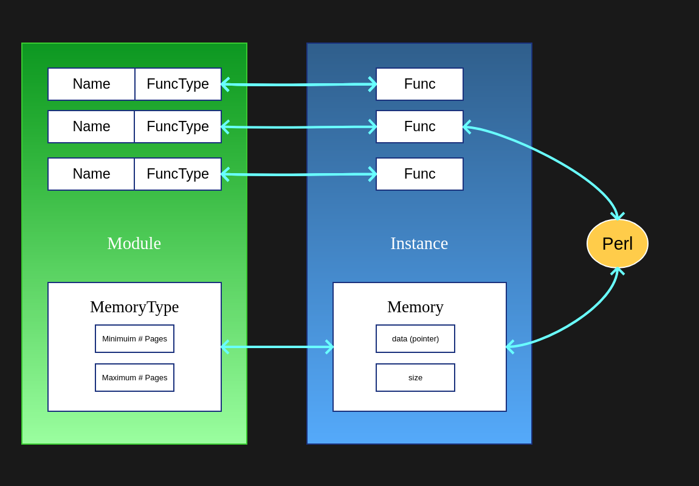
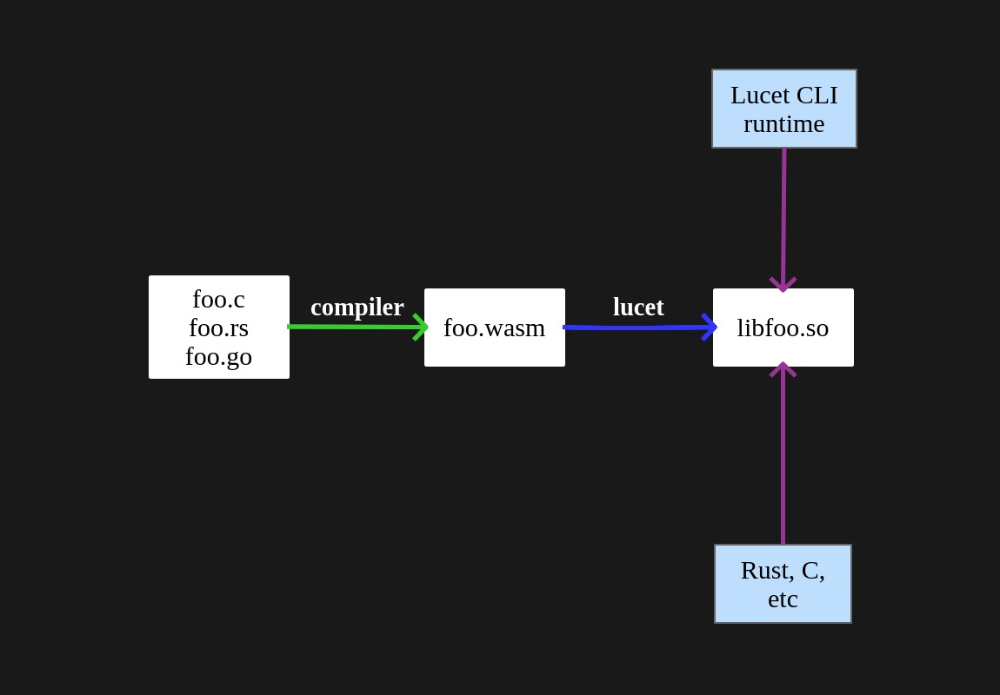

### Perl + WebAssembly

Let's write Perl bindings in WebAssembly!

---

### Graham Ollis

<div class="nx-hide-bullet">

*  Senior Software Engineer
*  [@plicease](https://twitter.com/plicease)
*  [github.com/plicease](https://github.com/plicease)
*  cpan: [PLICEASE](https://metacpan.org/author/PLICEASE)

</div>

---

### What is WebAssembly?

**WebAssembly** (Wasm) is a _fast_, _safe_ and _portable_ bytecode that can be used by
web browers for performance critical situations where plain JavaScript is not appropriate

---



---



---



---


**WebPerl** (https://webperl.zero-g.net) lets you script your web application with Perl
just like you might already be doing in JavaScript

---

<br>

<textarea class="perl-source" rows="10" cols="30">
#!perl
use strict;
use warnings;
use 5.010;
say "Hello from Perl!";
</textarea><textarea class="js-source" rows="10" cols="30" style="display: none">
// javascript
Perl.eval(`
  use strict;
  use warnings;
  use 5.010;
  say "Hello from JavaScript!";
  say "(via Perl)!";
`);
</textarea><textarea class="perl-output" rows="10" cols="60"></textarea>

---

### What is WebAssembly?

**WebAssembly** can also be useful in server applications where the sandboxed nature of
the technology allows running untrusted code that could misbehave

---



---

### Why WebAssembly?

* Pretty fast
* Pretty safe
* Easy introspection

---

### How WebAssembly?

**Wasmtime** is a Rust library that implements a WebAssembly runtime

---

**Wasmtime** has an FFI friendly C API, which means it can easily be called from any language with an FFI

---

**FFI::Platypus** is an FFI for Perl

---



---

Call WebAssembly from Perl

```perl [1-14|4-9|12|13|14]
use Wasm::Wasmtime;
 
my $module = Wasm::Wasmtime::Module->new( wat => q{
  (module
   (func (export "add") (param i32 i32) (result i32)
     local.get 0
     local.get 1
     i32.add)
  )
});
 
my $instance = Wasm::Wasmtime::Instance->new($module);
my $add = $instance->exports->add;
say $add->call(1,2);  # 3
```

---

Call Perl from WebAssembly

```perl [1-17|5-8|11-14|16-17|19]
use Wasm::Wasmtime;
 
my $s = Wasm::Wasmtime::Store->new;
my $module = Wasm::Wasmtime::Module->new($s, wat => q{
  (module
    (func $hello (import "" "hello"))
    (func (export "run") (call $hello))
  )
});
 
my $cb = Wasm::Wasmtime::Func->new(
  $s, [],[],
  sub { say "hello world!" },
);
 
my $instance = Wasm::Wasmtime::Instance
  ->new($module,[$cb]);

$instance->exports->run->call(); # hello world!
```

---

`Wasm.pm`

```perl [1-13|7-10|5]
package MathStuff;
 
use Wasm
  -api => 0,
  -exporter => 'all',
  -wat => q{ (module
    (func (export "add") (param i32 i32) (result i32)
      local.get 0
      local.get 1
      i32.add)
  ) };
 
1;
```

---

Call `MathStuff.pm`

```perl [1-3]
use MathStuff;

say add(1,2);  # 3
```

---

Call Perl from Wasm via `Wasm.pm`

```perl [1-13|1-3|5-11|13]
sub hello {
  print "hello world!\n";
}
 
use Wasm
  -api => 0,
  -wat => q{ (module
    (func $hello (import "main" "hello"))
    (func (export "run") (call $hello))
  ) }
;
 
run();   # hello world!
```

---

Creating zero-effort Wasm bindings with `Wasm::Hook`

```text [1-11|2-9|10|11]
$ mkdir -p src lib
$ cat > src/mathstuff.wat
(module
  (func (export "add") (param i32 i32) (result i32)
    local.get 0
    local.get 1
    i32.add)
)
^D
$ plasm wat src/mathstuff.wat
$ mv src/mathstuff.wasm lib/MathStuff.wasm
```

---

Calling zero-effort Wasm bindings with `Wasm::Hook`

```perl
use Wasm::Hook;
use MathStuff;

say add(1,2); # 3
```

---

### How WebAssembly + Python

```python
import wasmtime.loader
import MathStuff

print(add(1,2)); # 3
```

---

### How WebAssembly + Node.js

```javascript
import { add } from 'MathStuff.wasm';

console.log(add(1,2));  # 3
```

---

TODO: plasm

---

TODO: WASI

---

TODO: sandboxed WASI

---

### Related Tech

**XS**, **FFI** and Wasm are different types of Foreign Function interfaces

---

### Good/Bad of XS

<div class="nx-hide-bullet">

* &#9989; Native to Perl
* &#9989; Available everywhere Perl is
* &#9989; Great for extending Perl itself
* &#10060; Not applicable to other languages
* &#10060; Tedious for APIs with lots of functions
* &#10060; Requires a lot of reading:

</div>

---

perlxs

<iframe src="https://perldoc.perl.org/perlxs.html" style="width: 100%; height: 500px;"></iframe>

---

perlapi

<iframe src="https://perldoc.perl.org/perlapi.html" style="width: 100%; height: 500px;"></iframe>

---

perlguts

<iframe src="https://perldoc.perl.org/perlguts.html" style="width: 100%; height: 500px;"></iframe>

---

### Good/Bad of FFI

<div class="nx-hide-bullet">

* &#9989; FFI is available on all modern Perl platform
* &#9989; FFI is applicable to other languages (ruby, python, etc)
* &#10060; XS is tedious for APIs with lots of functions
* &#10060; C has terrible introspection 

</div>

---

**libclang** could potentially reduce the tedium of writing FFI bindings
by parsing C `.h` files for type and function declerations.

---

Even so, most C libraries will require at least *some* human intervention.

---

C has terrible introspection

```c [1-17|4-5|7|9|11-15]
#ifndef FOO_H
#define FOO_H

#define MODE1 1
#define MODE2 2

int add(int,int);

void print_string(const char *);

typedef strict {
  ...
} foo_t;

void process_list(foo_t *);

#endif
```

---

### Good/Bad of Wasm

<div class="nx-hide-bullet">

* &#10060; x86_64 and Arm 64 only
* &#10060; Binaries only for Linux, macOS and Windows
* &#9989; Wasm is applicable to lots of languages
 * Host: Perl / Python / Node.js
 * Guest: C / Rust / Go

</deiv>

---

### Good/Bad of Wasm

<div class="nx-hide-bullet">

* &#9989; Wasm *can* access the filesystem via WASI
* &#10060; Wasm does not typically have access to the network.
 * Porting SQLite or ImageMagik to Wasm is easy(ish)
 * Porting libcurl probably hard (for now)

</div>

---

### Good/Bad of Wasm

<div class="nx-hide-bullet">

* &#9989; Wasm bindings are almost effortless
* &#9989; Wasm has good introspection

</div>

---

### Good/Bad of Wasm

<div class="nx-hide-bullet">

* &#10060; Supported types: i32, i64, f32, f64<sup>*</sup>
* &#10060; Strings, arrays require some manual intervention<sup>*</sup>

</div>

<small style="margin-left: 60%; margin-top: 50px;"><sup>*</sup>Hopefully just until...</small>

---

Passing strings from Perl to WebAssembly<br>
(the C part)

```c [1-23|5|7-10|12-15|17-23|19|20|21|22]
#include &lt;stdlib.h>
#include &lt;stdio.h>
#include &lt;string.h>

#define EXPORT __attribute__ ((visibility ("default")))

EXPORT void *
_allocate(size_t size) {
  return malloc(size);
}

EXPORT void
_deallocate(void* ptr) {
  free(ptr);
}

EXPORT char *
_greet(const char *subject) {
  int len = strlen(subject) + strlen("Hello, ") + 1;
  char *greeting = malloc(len);
  snprintf(greeting, len, "Hello, %s", subject);
  return greeting;
}
```

---

Passing strings from Perl to WebAssembly<br>
(the Perl part)

```perl [1-31|19|20|22|24-27|29-30|32]
package Greet;

use strict;
use warnings;
use FFI::Platypus;
use FFI::Platypus::Memory qw( strcpy );
use base qw( Exporter );
use Wasm
  -api => 0,
  -self
;

our @EXPORT = qw( greet );

sub greet
{
  my($subject) = @_;

  my $input_offset = _allocate(length($subject) + 1);
  strcpy( $memory->address + $input_offset, $subject );

  my $output_offset = _greet($input_offset);

  my $greeting = FFI::Platypus->new->cast(
    'opaque', 'string', 
    $memory->address + $output_offset
  );

  _deallocate($input_offset);
  _deallocate($output_offset);

  return $greeting;
}

1;
```

---

Passing strings from Perl to WebAssembly<br>
(using it)


```perl [1-3]
use Greet;

say greet("Perl!");  # Hello, Perl!
```


---

WebAssembly **Interface Types** will allow host languages to call into WebAssembly pass strings other types without copies

---

This works because most languages store strings in the same way in linear memory

---

Objects can be stored as pointers...

---

Arrays should also be doable.

---

Passing strings from Perl to WebAssembly<br>
(aspirational)

```perl
user Wasm::Hook;
use Greet;

say greet("Perl!");  # Hello, Perl!
```

---

### Lucet

**Lucet** is a native WebAssembly compiler and runtime. It is designed to safely execute untrusted WebAssembly programs inside your application

---



---

### Any Questions? 

<div class="nx-hide-bullet">

* IRC **#native** on **irc.perl.org**
*  [github.com/perlwasm](https://github.com/perlwasm)
*  [@plicease](https://twitter.com/plicease)

</div>
