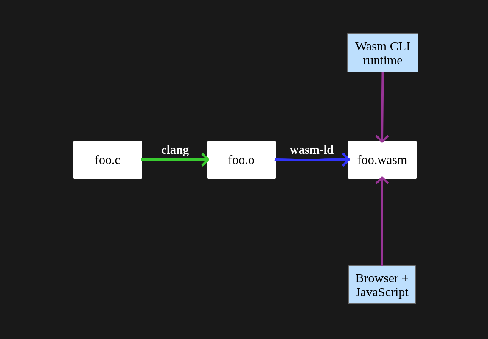

### Perl + WebAssembly

Let's write Perl bindings in WebAssembly!

Note:
Today I am going to talk about Perl and WebAssembly

---

### Graham Ollis

<div class="nx-hide-bullet">

*  Senior Software Engineer
*  [@plicease](https://twitter.com/plicease)
*  [github.com/plicease](https://github.com/plicease)
*  cpan: [PLICEASE](https://metacpan.org/author/PLICEASE)

</div>

Note:
My name is Graham Ollis,
I am a senior software engineer at Fastly
I am known on the internet as PLICEASE

---

 Perl

Note:
In my spare time I work on a number of Perl related open source projects.

There are two you may have heard of (or possibly even used)

---

**Alien::Build**

Note:
First is the Alien family of modules under the Alien-Build banner that let you declare external (non-CPAN) depdendnecies for 
your Perl projects

---

**FFI::Platypus**

Note: 
and the Platypus project which is an alternative foriegn function interface for Perl.

Platypus has some advantages over Perl's native foreign function interface XS,
espeically when you are writing library bindings and not extending the the Perl programming
language itself

And we will touch on Platypus in this talk because it is a related although different technology

---

### What is WebAssembly?

**WebAssembly** (Wasm) is a _fast_, _safe_ and _portable_ bytecode that can be used by
web browers for performance critical situations where plain JavaScript is not appropriate

Note:
Today though, I want to talk to you about WebAssembly or "Wasm", which is a fast, safe and portable bytecode
that can be used by web browsers in performance critical situations where JavaScript is not fast enough.

I think the key to WebAssembly's success is that it works well with a number of existing technologies
and toolchains.

---


Note:
For example, in a traditional Unix environment you would use a C compiler like clang to compile C
code into an object file, which can then be linked into an executable or a library which you can
run from the bash prompt or call from another program.  For example you can call a dynamic library
from Perl using Platypus.

---



Note:
It turns out modern clang supports WebAssembly as a backend so you can take the same sort of object file
and link it with the wasm linker and get a WebAssembly binary file.  The same file format is used for
both programs or libraries.  A program in fact is just a wasm file that happens to have a _start function.
So we can run a WebAssembly program using a command line runtime, or we can call into it from JavaScript
inside a web browser.

---


Note:
And you don't have to be a wiz with C either because there are some more modern languages like Rust or Go
that also support WebAssembly as a backend.  A lot of WebAssembly and the infrastructure to build and run
WebAssembly is written in Rust as it turns out.

---

### Why WebAssembly?

* Pretty fast
* Good tools
* Pretty safe
* Easy introspection

Note:
Why Wasm, and not JavaScript?  Well for CPU bound tasks it is much faster, and approaches the speed of natively compiled code.
For another reason, you can develop your web application in a mature compiled language like Rust or C ....
Finally, like JavaScript, WebAssembly lets you sandbox part of your application, so that you won't accdientally
(or intentionally in the case of malicious intent) take down the end user's system.  Also WebAssembly modules are easy to
intropsect, since the WebAssembly runtime has to know all the detail of exactly what gets passed between the guest and host
environment in order to keep things safe.

---

### How WebAssembly?

Note:
Let's try some demos!

---

<a href="https://plicease.github.io/hexed/" target="_hexed">HEXED.EXE running in a dos box!</a>

Note:
! Remember, to get out of full screen mode

In the 90s I wrote this hex editor for DOS.  I thought I was being pretty clever by calling it hexed.
Turns out that everyone else also called their HEX editor the same thing.

1. Open HEXED.EXE
2. Press F6 to get secondary view
3. etc..

This program was written in Turbo Pascal 7, which I loved programming back in the days.  I was excited to
learn this morning that Perl is going to finally surpass my beloved Turbo Pascal when it gets to
version 8.

Anyway, you get the idea here.  On modern hardware, this utility only works in an emulator like Dos Box.
And somebody has happily ported Dos Box to WebAssembly and called is JS-DOS.  Appropriately enough the
version is 6.22!  Dos Box is mostly useful for playing old games of course.  And originally I was going
to show you one of my old video games that I also write in the 90s.  But it was a little unimpressive after
of these years.

But much better and more resource intensive games can be run in the bowser this same WebAssembly.  I've seen one
demo of a WebAssembly version of Doom 3 running in the browser, and sure that game is almost 10 years old by now,
but the 3d and sound is pretty sophisticated for a browser tab!

---

<a href="https://d2jta7o2zej4pf.cloudfront.net/" target="_wasm_vide_editor">WebAssembly Video Editor<sup>*</sup></a>

<small><sup>*</sup>Credit to https://github.com/shamadee/web-dsp</small>


Note:
! Remember, to get out of full screen mode

Here we have a live video demo that shows WebAssembly and JavaScript applying filters to video real-time.

1. See if we can get the camera to work

---


**WebPerl** (https://webperl.zero-g.net) lets you script your web application with Perl
just like you might already be doing in JavaScript

Note:
One example of using WebAssembly in the browser is Perl itself.  The WebPerl project has the goal of allowing
developers to run Perl in the browser.  Since Perl itself is a C program, the WebPerl project has ported Perl to the
particular flavor of C supported by the compiler, and added some hooks to make it work in the browser's environment. 

---

<br>

<textarea class="perl-source" rows="10" cols="30">
#!perl
use strict;
use warnings;
use 5.010;
say "Hello from Perl!";
</textarea><textarea class="js-source" rows="10" cols="30" style="display: none">
// javascript
Perl.eval(`
  use strict;
  use warnings;
  use 5.010;
  say "Hello from JavaScript!";
  say "(via Perl)!";
`);
</textarea><textarea class="perl-output" rows="10" cols="60"></textarea>

Note:
WebPerl Demo!

1. use Perl to print to textarea
2. use JavaScript to print to textarea via Perl
3. use perl to access DOM (window.title)

---

**WebAssembly** can also be useful in server applications where the sandboxed nature of
the technology allows running untrusted code that could misbehave

Note:
WebAssembly can also be useful in server or command line applications where the sandboxed
nature of the technology allows running untrusted code that could misbehave.  This works
and can be relatively safe assuming you set the appropriate resource limitations

---

 Fastly


Note:
For example at Fastly, which is a content delivery network, we allow customers to provide
their own WebAssembly applications that are run on our cache nodes.  This allows our customers
to respond more quickly to their customers, in some cases, without having to go back to
their backend servers.  Since the code is run in a WebAssembly sandbox, we don't have to
worry about one customer taking down our cache nodes, or accessing a different customer's
data.

Previously customers could use a domain speicifc language called VCL to write their own
custom logic at the edge, but the ability to use general purpose programming language
like C, Rust or Go, and their well known toolchains gives our customers a lot of flexability
and power.

---


Note:
Being a Perl programmer, I am also interested in using WebAssembly from Perl.  The same
tools can be used to create a WebAssembly binary for use in perl that we used earlier
to write browser based web applications.

---

 Perl

* `Wasm::Wasmtime`
* `Wasm.pm`
* `App::plasm`

Note:
In persuit of this goal, I've written some modules to allow me to do that.

Wasm::Wasmtime is a low level library that lets you introspect and call WebAssembly code.
It binds to the Wasmtime runtime.

Wasm.pm is a higher level interface that makes it easy to call between Perl and WebAssembly without
having to know a lot about how WebAssembly works.

Finally plasm or PerL wASM is a tool for poking around with and running WebAssembly binaries
from the command-line.

---

### How WebAssembly?

**Wasmtime** is a Rust library that implements a WebAssembly runtime

Note:
Wasmtime is a popular Rust library that implements a WebAssembly runtime.

---

**Wasmtime** has an FFI friendly C API, which means it can easily be embedded in any language with an FFI

Note:
Helpfully, Wasmtime has a very FFI friendly C API, which means that it can pretty easily be embedded in any modern
programming language.

---

**FFI::Platypus** is an FFI for Perl

Note:
Remember from before, that Platypus is an FFI for Perl

---

**Wasm::Wasmtime** is a set of Wasmtime bindings for Perl written using FFI::Platypus

Note:
So I wrote Wasm::Wasmtime using Platypus

---


Note:
Here is a diagram of how some of the most important classes in wasmtime work.

1. The module object is a compiled in-memory representation of a WebAssembly binary.
2. The module object can contain a number of name/FuncType mappins.
3. A FuncType is just a function signature, so this tells us what the functions are called and how to call them
4. The module object also contains other useful objects that let us introspect the WebAseembly binary
5. The most important after the functions is the MemoryType.  This tells us the minimum and maxiumum number of
pages the WebAssembly requires.

1. A Wasmetime instance object can be created from the module object
2. This is what we use to actually call Func objects
3. And access the WebAssembly's Memory object which gives us a data pointer and a size of the memory region used by the
WebAssembly module instance
4. Importantly, although we can poke around with Wasm's memory from Perl, WebAssembly cannot address memory outside of
its own region

---

Convert WebAssembly Text to WebAssembly binary

```perl [1-3|3]
use Wasm::Wasmtime::Wat2Wasm;

my $wasm = wat2wasm('(module)');
```

Note:
Wasmtime also has a number of utility functions.  wat2wasm for example, translates WebAssembly Text into WebAssembly binary.
We need to do this translation in order for the Wasmtime runtime to be able to execute WebAssembly.

1. Here we are converting the most simple WebAssembly module possible, one that doesn't do anything.

---

**Wasm::Wasmtime::Linker** links together multiple WebAssembly modules

Note:
I would also like to mention the Wasmtime linker, which is a runtime linker that makes it easy for
two or more WebAssembly modules to call each other.  I won't be showing any examples of this, but
the higher level Wasm.pm interface uses this to offload much of the work of linking things together
using this class.

---

Call WebAssembly from Perl

```perl [1-14|4-9|5-8|12|13|14]
use Wasm::Wasmtime;
 
my $module = Wasm::Wasmtime::Module->new( wat => q{
  (module
   (func (export "add") (param i32 i32) (result i32)
     local.get 0
     local.get 1
     i32.add)
  )
});
 
my $instance = Wasm::Wasmtime::Instance->new($module);
my $add = $instance->exports->add;
say $add->call(1,2);  # 3
```

Note:
Lets look at some code that calls WebAssembly from Perl

1. The WebAssembly text is passed into the module constructor.  
Under the covers wat2wasm is called.
Passing in the WebAssembly text is helpful for examples, and for experimenting with WebAssembly.
In production you would likely want to use WebAssembly binary here, which you can pass in directly,
or by providing a filename.
2. The module has just one function, which adds two integers together.
3. We then instantiate the WebAssembly by creating an instance object.
4. We query the instance object for the add function
5. And now we can call it.  We pass in the values 1 and 2 and 3 is returned as you would expect.

---

Attaching WebAssembly from Perl

```perl [1-14|13-14]
use Wasm::Wasmtime;

my $module = Wasm::Wasmtime::Module->new( wat => q{
  (module
   (func (export "add") (param i32 i32) (result i32)
     local.get 0
     local.get 1
     i32.add)
  )
});
 
my $instance = Wasm::Wasmtime::Instance->new($module);
$instance->exports->add->attach;
say add(1,2);  # 3
```

Note:
If you don't want to muck about with Func objects,

1. then you can attach and call them like regular Perl subroutines.

---

Call Perl from WebAssembly

```perl [1-17|5-8|6|7|11-14|16-17|19]
use Wasm::Wasmtime;
 
my $s = Wasm::Wasmtime::Store->new;
my $module = Wasm::Wasmtime::Module->new($s, wat => q{
  (module
    (func $hello (import "" "hello"))
    (func (export "run") (call $hello))
  )
});
 
my $cb = Wasm::Wasmtime::Func->new(
  $s, [],[],
  sub { say "hello world!" },
);
 
my $instance = Wasm::Wasmtime::Instance
  ->new($module,[$cb]);

$instance->exports->run->call(); # hello world!
```

Note:
You can also call WebAssembly from Perl!

1. Again, we provide the WebAssembly text inline here.  This module has two functions, 
2. One is imported from Perl called hello
3. The other is exported from this module and called run
4. Next we create a Wasmtime func object for our Perl callback
5. When we create the instance object this time, we have to provide the callback.  In this case we have
just one import, but if you have more than one you have to provide them in the same order in which
they are declared in the WebAssembly.
6. Finally we can call the WebAssembly run function which calls the Perl callack which prints out hello world.

---

`Wasm.pm`

```perl [1-13|7-11|5]
package MathStuff;
 
use Wasm
  -api => 0,
  -exporter => 'all',
  -wat => q{ (module
    (func (export "add") (param i32 i32) (result i32)
      local.get 0
      local.get 1
      i32.add)
  ) };
```

Note:
That is a lot of work though, and most of the time you don't want or need to do that level of introspection.
That is what Wasm.pm is for.

Wasm.pm doesn't expose the Wasmtime interface at all.  That is an intentional design decision.  Just in case we decide to
change the lower-level implementaton later.  I prefer Wasmtime for the time being, but there are similar projects like Wasmer
that might make sense down the line.  It might even make sense to support multiple implementation and decide at runtime which
one to use.

1. Again, we provide the WebAssembly text inline, but you could provide WebAssembly binary here, or an external WebAssembly
file.
2. As a convenience we use the exporter option to have all exported functions automatically exported to the calling module.
We could also say 'ok' instead to have them imported on request.  Under the covers the Perl Exporter module is used to do
the actual import.  That is an important detail I think.  Where possible I tried to make Wasm.pm use existing Perlish interfaces.

---

Call `MathStuff.pm`

```perl [1-3]
use MathStuff;

say add(1,2);  # 3
```

Note:
Now we can use our MathStuff module just like any other Perl module.  You don't even need to know or care what
language or binary format is being used under the covers.  This could be an XS, or FFI or even a pure-perl module.

---

Call Perl from Wasm via `Wasm.pm`

```perl [1-13|1-3|5-11|13]
sub hello {
  print "hello world!\n";
}
 
use Wasm
  -api => 0,
  -wat => q{ (module
    (func $hello (import "main" "hello"))
    (func (export "run") (call $hello))
  ) }
;
 
run();   # hello world!
```

Note:
You can of course call Perl from WebAssembly using the Wasm.pm interface.

1. Here we just define a Perl subroutine "hello".  This time we don't have to wrap it in a Func object.
2. The WebAssembly asks to import hello from the main package.  Notice that the WebAssembly code doesn't need to know
or care what language the hello function is implemented in.
3. Finally we can call the WebAssembly run function which calls the Perl helo subroutine, which then prints out our message.

---

Zero-effort Wasm bindings with `Wasm::Hook`

```text [1-11|2-9|10]
$ mkdir -p src lib
$ cat > src/mathstuff.wat
(module
  (func (export "add") (param i32 i32) (result i32)
    local.get 0
    local.get 1
    i32.add)
)
^D
$ wat2wasm &lt; src/mathstuff.wat &gt; lib/MathStuff.wasm
```

Note:
Honestly though, even that is WAY too much work!  With Wasm::Hook we can reduce the boilerplate even more.

1. We write some WebAssembly text that will implement our module.  In this case we are using WebAssembly Text, but with the
right tools this could also be C, Rust or Go.
2. We use the wat2wasm command-line tool to convert the WebAssembly text to WebAssembly binary and place it
where you would normally expect to see the .pm if this were a pure-perl module.

---

Calling zero-effort Wasm bindings with `Wasm::Hook`

```perl [1-4]
use Wasm::Hook;
use MathStuff;

say add(1,2); # 3
```

Note:
But we don't need to a .pm file, because Wasm::Hook installs an @INC hook to find WebAsembly binary files and generates the
necessary boilerplate for us.

The nice thing here is that we can now take this WebAssembly binary module, and use it on any platform supported by Wasm.pm.
You no longer have to worry about compiler options on an obsecure dialect of Unix.  You get some of the beneifts of a pure-perl
module, with some of the performance benifits of XS or FFI.

---

### How WebAssembly + Python

```python [1-4]
import wasmtime.loader
import MathStuff

print(add(1,2)); # 3
```

Note:
In fact we can reuse it in other langauges too.  Python has a wasmtime.loader interface that lets us use the same module from
Python.

---

### How WebAssembly + Node.js

```javascript [1-3]
import { add } from 'MathStuff.wasm';

console.log(add(1,2));  # 3
```

Note:
You can also do the same thing with Node.js.  Since the Wasmtime module class has all of the information that we need to
know in order to find and call WebAssembly functions we should be able to reuse this module in any langauge that has
sufficiently advanced Wasmtime bindings.

---

**App::plasm** is a CLI tool for WebAssembly binaries

Note:
plasm or PerL wASM is a command-line tool for webassembly binaries.

---

```c [1-9]
#include &lt;stdio.h>

int
main(int argc, char *argv[])
{
  printf("Hello World!\n");
  for(int i=1; i&lt;argc; i++)
    printf("argv[%d] = \"%s\"\n", i, argv[i]);
}
```

Note:
Lets use this very simple C program that prints a greeting and the command-line arguments that are passed to it.

---

```text [1-5]
$ wacc hello.c -o hello.wasm
$ plasm run hello.wasm one two
Hello World!
argv[1] = "one"
argv[2] = "two"
```

Note:
We can compile the C into a WebAssembly binary and run it with the plasm run subcommand.  It works exactly as if it were a native C program.

---

```text [1-12|11|10|3|4-5|6-9]
$ plasm dump hello.wasm 
(module
  (func (import "wasi_snapshot_preview1" "proc_exit") (param i32))
  (func (import "wasi_snapshot_preview1" "args_sizes_get") (param i32 i32) (result i32))
  (func (import "wasi_snapshot_preview1" "args_get") (param i32 i32) (result i32))
  (func (import "wasi_snapshot_preview1" "fd_seek") (param i32 i64 i32 i32) (result i32))
  (func (import "wasi_snapshot_preview1" "fd_close") (param i32) (result i32))
  (func (import "wasi_snapshot_preview1" "fd_fdstat_get") (param i32 i32) (result i32))
  (func (import "wasi_snapshot_preview1" "fd_write") (param i32 i32 i32 i32) (result i32))
  (memory (export "memory") 2)
  (func (export "_start") )
)
```

Note:
We can also use the plasm dump subcommand to print out the interface for this WebAssembly binary.


1. As you might expect there is a _start function, which is what makes it a program and not just a library.
2. There is also a memory export so that the host language can interact with the WebAssembly's linear memory region.

This program also imports a number of functions that you might think would interact with the operating system.
In this case you'd be right.

3. proc_exit implemnts the C exit function.
4. There are a copuple of argument processing function that lets the program get the command-line arguments.
5. There are a number of functions with the fd_ prefix that do IO.

---

```text [1-12|9]
$ cat hello.c          
#include &lt;stdio.h>

int
main() { }
$ wacc -o hello.wasm hello.c
$ plasm dump hello.wasm     
(module
  (func (import "wasi_snapshot_preview1" "proc_exit") (param i32))
  (memory (export "memory") 2)
  (func (export "_start") )
)
```

Note:
As an aside, if we have less complicated program that doesn't query the command-line, or do IO, we get a much shorter
list of imports.  That is because WebAssembly only generates code and interfaces for the objects that get used by the module.
This makes sense since you don't want to ship the entire libc a web browser if you are only using parts of it.

1. All of these system functions are imported from wasi_snapshot_preview1, what is that?

---

**WebAssembly System Interface** (**WASI**) is a simple interface (ABI and API) designed by Mozilla.

Note:
The WebAssembly System Interface or WASI is a simple ABI and API designed by Mozilla.

---

**WASI** is portable to any platform

Note:
WASI is portable to any platform

---

**WASI** provides POSIX features like file I/O constrained by capability-based security.

Note:
It provides POSIX features like file I/O, which can be configured for the security conscious by the WebAssembly runtime.

---

**Wasmtime** comes with a configurable *WASI*

```perl [1-16|7|8-9|10|12-16]
use Wasm::Wasmtime;

my $store = Wasm::Wasmtime::Store->new;
my $config = Wasm::Wasmtime::WasiConfig->new;

$config
  ->set_env({ FOO => 1, BAR => 2 })
  ->set_stdout("/tmp/wasi-stdout.txt")
  ->set_stderr("/tmp/wasi-stderr.txt")
  ->preopen_dir("/","/tmp/wasi-sandbox");

my $wasi = Wasm::Wasmtime::WasiInstance->new(
  $store,
  "wasi_snapshot_preview1",
  $config
);
```

Note:
Wasmtime comes with a default WASI that can be configured for your security needs.
Wasm.pm by default gives full access to the local system, though I plan on adding an isolation option.
This will allow specific modules to be isolated from other WebAssembly modules, from Perl or the operating system.

If you are using the lower-level Wasm::Wasmtime interface you can already grant specific access to specific resources
when creating the WASI instance.

1. In this example we set the environment using a hash reference, instead of using the real system's environment
2. We can redirect the standard output streams to files on disk
3. And map the guest's root file system to a protected directory on the host.
4. Once configured we can create a WASI instance that can be used with the Wasmtime linker.

---

We could also implement our own **WASI** in *Perl*

Note:
We could also implement our own WASI in PERL.  If we wanted to have a virtual file system backed by the network,
or if we wanted command-line options come from a database for example.  There are lots of possible applications.

---

**XS**, **FFI** and Wasm are different types of Foreign Function Interfaces

Note:
XS, FFI and Wasm are different types of Foreign Function Interfaces, each with their pluses and minuses

---

**XS** 

<div class="nx-hide-bullet">

* &#9989; Native to Perl
* &#9989; Available everywhere Perl is
* &#9989; Great for extending Perl itself
* &#10060; Not applicable to other languages
* &#10060; Tedious for APIs with lots of functions
* &#10060; Steep learning curve
* &#10060; and lots of gotchas

</div>

Note:
1. XS is native to Perl, which means that it is available everywhere that Perl is
2. It is great for extending Perl itself
3. It is a bit esoteric though and quite different from the way most programming languages are
extended, so it isn't applicable to most other languages or technologies.
4. It can be very tedius to write Perl bindings for APIs with lots of functions.
5. The full XS API... if you could call it an API... is quite complicated and has a very steep learning curve...
6. and even for experienced XS programmers there are lots of sharp edges and gotchas.

---


Note:
There is lots of documentation for XS, this for example is the perlxs man page.  Everyone please read everything on
this page.  (count to ten)  Got all of that?  After reading this, and perlguts and perlapi (which are even longer)
you are starting to be proficient in XS.

---

**FFI** and **FFI::Platypus**

<div class="nx-hide-bullet">

* &#9989; Available on all modern Perl platform
* &#9989; Applicable to other languages (ruby, python, etc)
* &#10060; Tedious for APIs with lots of functions
* &#10060; C is terrible at introspection 

</div>

Note:
1. Platypus is available on all modern Perl platforms, probably any that you are likely to use in practice.
2. I find that FFI bindings are fairly easy to port from language to language.  I have often borrowed FFI
bindings from Ruby for use in Perl.  Wasm::Wasmtime itself was heavily influrnced by the already existing Python
bindings for the same library.
3. Like XS it can be very tedius to write Perl bindings for APIs with lots of functions.
4. Although one goal of the Platypus project is to be language neutral, most libraries that you are likely to 
write bindings for have a C interface, and C is terrible at introspection.  This means it is a challenge to
automate binding generators.

---

**libclang** could potentially reduce the tedium of writing FFI bindings
by parsing C header files for type and function declarations.

Note:
libclang, which is an API to the clang parser could potentially reduce the tedium of writing FFI bindings
by parsing C `.h` files for type and function declerations.

---

Even so, most C libraries will require at least *some* human intervention.

Note:
Still, most C libraries require at least some human intervention to implemnet correctly.

---

```c [1-17|4-5|7|9|11-15]
#ifndef FOO_H
#define FOO_H

#define MODE1 1
#define MODE2 2

int add(int,int);

void print_string(const char *);

typedef struct {
  ...
} foo_t;

void process_list(foo_t *);

#endif
```

Note:
Let me give you a sense of why by looking at this header file.

1. Constants are often defined using the C pre-processor, which means the compiler (and libclang) dont even see them.
That means if you want to introspect for constants you can't use libclang, and instead have to use another tool like
the C pre-processor itself.
2. For a simple function that takes basic non-pointer, non-array types you are golden, there aren't many ways this add function
could be called.
3. Likewise this print_string function is pretty clear.  A const char star is usually a NULL terminated string, although
technically it could be a pointer to a single eight bit byte.
4. This process_list function obviously takes a list of structs from the name, but there is no way for an automated tool to
know that it isn't a pointer to a single object.

---

**Wasmtime** 

<div class="nx-hide-bullet">

* &#9989; x86_64 and Arm64 are supported
* &#9989; Binaries for Linux, macOS and Windows
* &#10060; No 32bit support
* &#10060; Limited support for other operating systems (for now)

</div>

Note:
For Wasmtime, the good news is that the most common CPUs and platforms are supported.
Intel and Arm 64 bit, Linux, macOS and Windows.
Unfortunately if you are on 32 bit or on a less common operating system you are out of luck.  At least for now.

---

**Wasmtime**

<div class="nx-hide-bullet">

* &#9989; Wasm is applicable to lots of languages
 * Host: Perl / Python / Node.js
 * Guest: C / Rust / Go

</deiv>

Note:
On the other hand a lot of modern languages are supported as both hosts and guests.  Another plus
is that all of these languages have robust, fairly mature toolchains, and a lot of experienced developers
know how to exploit them.

---

**Wasmtime**

<div class="nx-hide-bullet">

* &#9989; Wasm *can* access the filesystem via WASI
* &#10060; Wasm does not typically have access to the network.
 * Porting SQLite or ImageMagik to Wasm is easy(ish)
 * Porting libcurl probably hard (for now)

</div>

Note:
1. As we showed with the WASI interface, WebAssembly can access the filesystem, or at least some filesystem
that might be virtualized.
2. It doesn't typically have direct access to the network unless you write bindings for it
3. Which means things like SQLite or ImageMagik should be easyish to port to webAssembly,
4. But something like libcurl would be quite difficult.


---

**Wasmtime**

<div class="nx-hide-bullet">

* &#9989; Wasm bindings are almost effortless
* &#9989; Wasm has good introspection

</div>

Note:
1. The really great thing about WebAssembly is that the bindings themselves are almost effortless.
2. As I showed before, thanks to the security needs of WebAssembly, introspection is quite good.

---

**Wasmtime**

<div class="nx-hide-bullet">

* &#10060; Supported types: i32, i64, f32, f64<sup>*</sup>
* &#10060; Strings, arrays require some manual intervention<sup>*</sup>

</div>


<small style="margin-left: 60%; margin-top: 50px;"><sup>*</sup>For now</small>

Note:
1. Only basic number types are supported.
2. Strings, arrays and nested datatypes stypically require peeking into the WebAssembly's linear memory region, and
some knowldge of the way that the guest language stores these data structures.  At least we have access to this
memory region though.

---

Passing strings from Perl to WebAssembly<br>
(the C part)

```c [1-23|5|7-10|12-15|17-23|19|20|21|22]
#include &lt;stdlib.h>
#include &lt;stdio.h>
#include &lt;string.h>

#define EXPORT __attribute__ ((visibility ("default")))

EXPORT void *
_allocate(size_t size) {
  return malloc(size);
}

EXPORT void
_deallocate(void* ptr) {
  free(ptr);
}

EXPORT char *
_greet(const char *subject) {
  int len = strlen(subject) + strlen("Hello, ") + 1;
  char *greeting = malloc(len);
  snprintf(greeting, len, "Hello, %s", subject);
  return greeting;
}
```

Note:
Here is an example of how you would write some bindings to a library that takes strings as input and output.

1. First we need to tell the C compiler which symbols should be exported using this incantation.
2. Next we write a wrapper around the malloc
3. and free functions so that we can allocate and free memory from Perl space.
4. Now we have a function that takes a subject and returns a greeting to that subject.
5. So we compute the length of the output string
6. Allocate the memory
7. Create the greeting from a template using sprintf
8. And return it.

---

Passing strings from Perl to WebAssembly<br>
(the Perl part)

```perl [1-31|15-20|26|27|29|31-33|35-36|38]
package Greet;

use strict;
use warnings;
use FFI::Platypus;
use FFI::Platypus::Memory qw( strcpy );
use base qw( Exporter );
use Wasm
  -api => 0,
  -self
;

our @EXPORT = qw( greet );

{
  # this just uses Platypus to create a utility function
  # to convert a pointer to a C string into a Perl string.
  my $ffi = FFI::Platypus->new( api => 1 );
  $ffi->attach_cast( 'cstring' => 'opaque' => 'string');
}

sub greet
{
  my($subject) = @_;

  my $input_offset = _allocate(length($subject) + 1);
  strcpy( $memory->address + $input_offset, $subject );

  my $output_offset = _greet($input_offset);

  my $greeting = cstring(
    $memory->address + $output_offset
  );

  _deallocate($input_offset);
  _deallocate($output_offset);

  return $greeting;
}
```

Note:
We aren't done yet though.  There is still some Perl code to write.

1. This little incantation creates a function cstring that converts a NULL terminated string to a Perl string.
We will need that later.
2. We have to allocate space for the input string in the WebAssembly memory region
3. Copy our Perl string into WebAssembly memory
4. Call the WebAssembly greet function.  This returns the offset of the output string.
5. Convert the return value back into a Perl string
6. Free the input and output strings in WebAssembly memory, so that we don't leak memory.
7. And finally return the greeting.

---

Passing strings from Perl to WebAssembly<br>
(using it)


```perl [1-3]
use Greet;

say greet("Perl!");  # Hello, Perl!
```

Note:
We can finally call our WebAssembly that works with strings from perl.

---

```perl [1-29|1|9-14|11|12|13|20-21|27|22-25]
use Wasm::Memory qw( wasm_caller_memory );

{
  use FFI::Platypus 1.00;
  my $ffi = FFI::Platypus->new( api => 1 );
  $ffi->attach_cast( 'cstring' => 'opaque' => 'string' );
}

sub print_wasm_string
{
  my $offset = shift;
  my $memory = wasm_caller_memory;
  print cstring($offset + $memory->address);
}

use Wasm
  -api => 0,
  -wat => q{
    (module
      (import "main" "print_wasm_string" 
        (func $print_wasm_string (param i32)))
      (func (export "run")
        i32.const 0
        call $print_wasm_string
      )
      (memory (export "memory") 1)
      (data (i32.const 0) "Hello, world!\n\00")
    )
  },
;

```

Note:
The next trick I want to show you is calling a Perl subroutine that takes a string from WebAssembly.

The thing that the callback needs to know is which memory region to read from, since there could be multiple WebAssembly modules
in your program.

This is exactly the sort of thing that you need to deal with by-the-way- if you were writing a WASI implementation as I was
describing earlier, because a lot of WASI's functionality requires reading and writing the caller's memory region.

1. For that context, we are going to import the wasm_caller_memory function, which is somewhat inspired by the Perl caller function.
They both give us information about who is calling us in the current context.
2. Next we write a function to print a wasm string.
3. Since we can only pass numbers, we pass a memory offset
4. We call the wasm_caller_memory function which returns the memory region that we need.
If the subroutine happens to be called from Perl, this will give us undef.
5. With the pointer and offset we can convert the C string to a Perl string and print it out.
6. From the WebAssembly side we import the print_wasm_string function from the main package using the appropriate
function signature.
7. We use a WebAssembly data segment to store the string in.  Alternatively, we could also use dynamically allocated memory
8. Finally we can write our run function, which calls the perl subroutine.


---

Not pretty

Note:
After working so easily in WebAssembly with numbers, the complexity of working with strings makes just makes me want to cry.
Espeically as a Perl programmer where strings are sort of our thing.

---

WebAssembly **Interface Types** will allow host languages to call into WebAssembly pass strings other types without copies

Note:
There is hope though!

WebAssembly Interface Types promises to address this.  Interface Types provide an extra layer inside the WebAssembly binary
that tell the host how to translate complicated types like strings.  The current proposal converts things lazily and avoids
copies where possible.  So it should be possible to implement this fairly efficiently.

An earlier prototype of Interface Types was actually included in an earlier version of Wasmtime, but they removed it because
the implementation was diverging from the proposal.  This was dissappointing to be sure, but good in the long run.  I think
they will be implmenting it right rather than quickly.

---

This works because most languages store strings in the same way in linear memory

Note:
All of this works because most languages store strings in more or less the same way in linear memory.

---

Objects can be stored as pointers...

Note:
Objects can be stored as pointers...

---

Arrays and structs should also be doable.

Note:
Arrays and structured data should also be doable.

---

Passing strings from Perl to WebAssembly<br>
(aspirational)

```perl [1-4]
use Wasm::Hook;
use Greet;

say greet("Perl!");  # Hello, Perl!
```

Note:
With Interface Types we should be able to drop the explicit memory allocation wrappers and the Greet.pm file,
and go back to just calling the WebAssembly from Perl directly.

---

The interfaces for calling **WebAssembly** from Perl using **Wasm::Wasmtime** could be faster

Note:
Another challenges for the current implementation of my Wasmtime bindings is that the method used to
call and attach WebAssembly functions is probably suboptimal.  This is a hotspot that we could pretty
easily make faster, which would be a big benefit.  I say this from experience working with FFI in Perl.

---

```perl [1-9|3-7|9]
use FFI::Raw;

my $cos = FFI::Raw->new(
  'libm.so', 'cos',
  FFI::Raw::double,
  FFI::Raw::double,
);

say $cos->call(2.0);
```

Note:
FFI::Raw for example was the only FFI game in town before Platypus.  I know it pretty well because I wrote
some libarchive bindings using it in order to learn FFI.  What I learned from that process I used
when designing Platypus.

1. Anyway, FFI::Raw lets you construct an object for each C function that you want to call.
2. Then you can call that function using the object's call method.  Seems okay?  Except method calls
are relatively slow because at compile time we don't know what class this object belongs to, and
therefore which exact function needs to be executed.  We have to instead compute all of that at runtime.
Which is kind of sad, because you basically never need to subclass FFI::Raw so you are paying this penalty
for all FFI functions for now reason.

---

```perl [1-9|3|5-6|8-9]
use FFI::Platypus 1.00;

my $ffi = FFI::Platypus->new( api => 1, lib => [undef] );

my $cos = $ffi->function( cos => [ 'double' ] => 'double' );
say $cos->call(2.0);

$cos->attach;
say cos(2.0);
```

Note:
Platypus is a took a different approach.

1. To start, the main object represents the library that you are calling into, not a function.  You typically only need it
when you are building your interface, where the overhead of method calls is acceptible.
2. You still have the option of creating and calling a function object, the flexability here comes at a performance cost.
3. But the killer feature of Platypus is that you can attach a function as an xsub, and you get performance which is
close to XS.


---

```c [1]
  self = (ffi_pl_function*) CvXSUBANY(cv).any_ptr;
```

Note:
The key to all of this working is the any_ptr which hangs off of an xsub.  Normally it is NULL, but we can put anything
we want here.  In the case of Platypus, we put the metadata that libffi needs in order to make the underlying C function
call.  I didn't come up with this technique, by the way.  It was BULK88 who showed me how to do this, and he was using the
same technique in Win32::API.  I needed to be able to do FFI in non-Windows platforms though, which is why we have Platypus
today.

---

**Wasm::Wasmtime::XS** anyone?

Note:
What makes sense here I think is to write some XS to implement the call and attach functionality of Func objects.
We can use the same any_ptr technique to make attached functions quite fast.
There really isn't any beneift to rewriting the entire API in XS.  I think it would probably be counter productive
in fact.  This is exactly what XS is good for though, which is extending the Perl programming language itself.

This module should be optionally installed when a compiler is available, and a fallback to the current FFI
implementation if it isn't.

---

**Lucet** is a native WebAssembly compiler and runtime.

Note:
Another interesting piece of tech I want to mention is the Lucet compiler that was developed in house at Fastly and is now
opensource.  Lucet is a native WebAssembly compiler and runtime.

---

**Lucet** ahead of time compiles *WebAssembly* to native x86_64 code for even better performance

Note:
Lucet ahead of time compiles WebAssembly to native 64 bit intel for even better performance.

---

**Lucet** binaries have the same sandbox safety as regular WebAssembly runtimes, so it is safe
to run untrusted WebAssembly inside your application.

Note:
At the same time Lucet binaries have the same sandbox safety as regular WebAssembly runtimes, so
it is safe to run untrusted WebAssembly inside your application, provided that you configure with
appropriate limits.

---


Note:
Here is the same diagram from before, except now someone (doesn't have to be you) compiles a program into
WebAssembly, which is then converted into a dynamic library by Lucet.  The resulting dynamic library can
be run using the Lucet runtime command-line interface if it has a _start function, or called from another
programming language.

There are no Perl bindings for any of this, but there might be some useful applications for this technology.

---

Questions? 

<div class="nx-hide-bullet">

* IRC **#native** on **irc.perl.org**
*  [github.com/perlwasm](https://github.com/perlwasm)
*  [@plicease](https://twitter.com/plicease)

</div>

Note:
That is all that I have for today.  If you are interested in WebAssembly, you should definitely come join us on
that IRC #native channel, or the perlwasm github organization.

I've discussed that the WebAssembly Perl modules that I've written have some limitations.  I think that addressing
some of those limitations could make interesting projects for those who are interested in the technology.  I'd
welcome collaborations to that end.

The #native channel i also godo to discuss Alien and Platypus tech if that sounds interesting.

Any questions?
