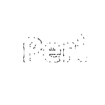

### Perl + WebAssembly

Let's write Perl bindings in WebAssembly!

---

### Graham Ollis

<div class="nx-hide-bullet">

*  Senior Software Engineer
*  [@plicease](https://twitter.com/plicease)
*  [github.com/plicease](https://github.com/plicease)
*  cpan: [PLICEASE](https://metacpan.org/author/PLICEASE)

</div>

---

### What is WebAssembly?

**WebAssembly** (Wasm) is a _fast_, _safe_ and _portable_ bytecode that can be used by
web browers for performance critical situations where plain JavaScript is not appropriate.

---


---


---



[WebPerl](https://webperl.zero-g.net) lets you script your web application with Perl
just like you might already be doing in JavaScript.

---

<br>

<textarea class="perl-source" rows="10" cols="30">
#!perl
use strict;
use warnings;
use 5.010;
say "Hello from Perl!";
</textarea><textarea class="js-source" rows="10" cols="30" style="display: none">
// javascript
Perl.eval(`
  use strict;
  use warnings;
  use 5.010;
  say "Hello from JavaScript!";
  say "(via Perl)!";
`);
</textarea><textarea class="perl-output" rows="10" cols="60"></textarea>

---

### What is WebAssembly?

**WebAssembly** can also be useful in server applications where the sandboxed nature of
the technology allows running untrusted code that could misbehave.

---

### Why WebAssembly?

---

### How WebAssembly?

```perl
use Wasm;
```

---

### Wasmtime

```perl
use Wasm::Wasmtime
```

---

### How WebAssembly + Python

---

### How WebAssembly + Node.js

---

### WebAssembly vs. FFI

---

### WebAssembly vs. XS

---

### WebAssembly Interface Types

---

### Lucet

---

### Any Questions? 

<div class="nx-hide-bullet">

* IRC #native on irc.perl.org
*  [github.com/perlwasm](https://github.com/perlwasm)

</div>
